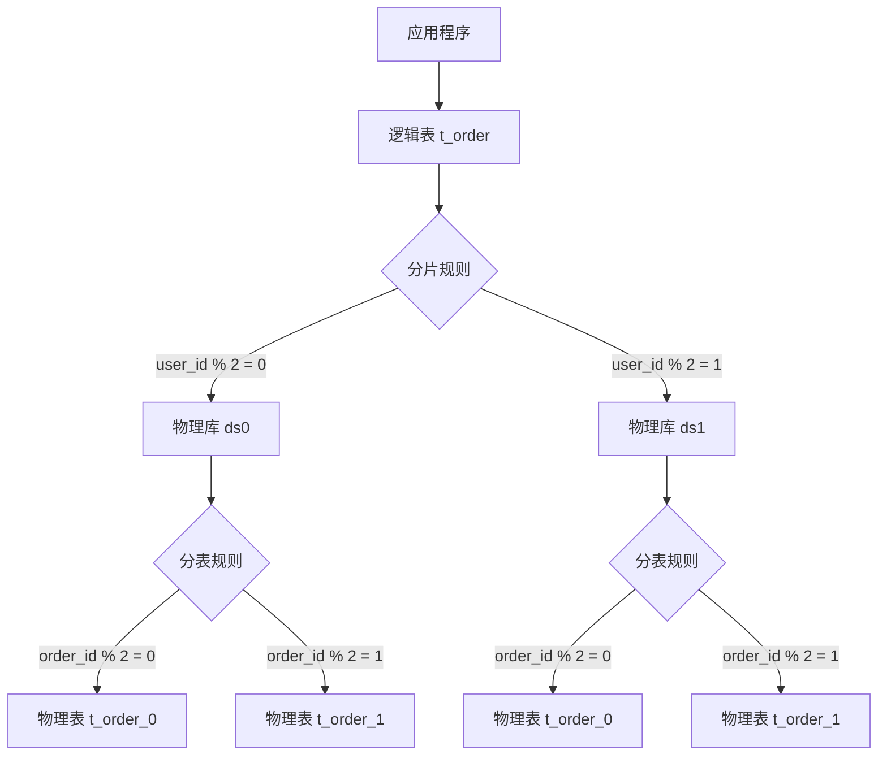
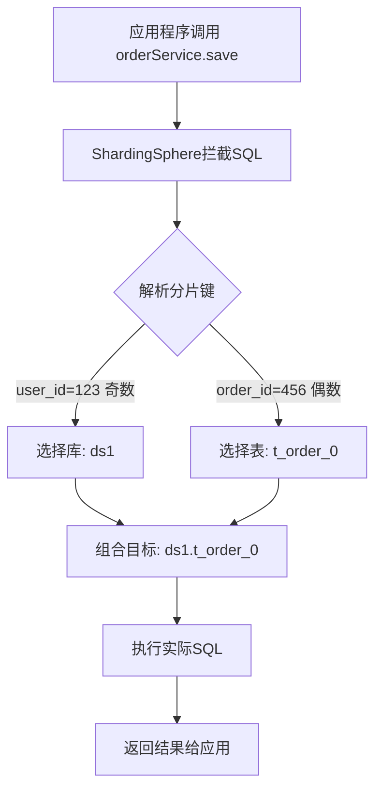

@[toc]

# 1. 分库分表：为什么要把数据“打散”？

想象一下，你有一个巨大的仓库（单库单表），里面堆满了货物（数据）。起初，仓库管理起来很轻松，但随着业务发展，货物越来越多，仓库管理员（数据库）开始手忙脚乱：找一件货要翻很久（查询慢），同时只能让一个人进去搬货（并发低），甚至仓库快被撑爆了（存储瓶颈）。

**分库分表**，就是把这个大仓库拆分成多个小隔间（分库）和多个货架（分表），让多个管理员同时工作，解决“爆仓”和“拥堵”问题。

## 1.1 核心概念：水平拆分 vs 垂直拆分

### 垂直拆分（Vertical Sharding）：按“列”切分
就像把一本厚厚的书拆成几本小册子。我们把一张表的不同字段拆到不同的表中，或者把不同的业务表（如用户表、订单表）放到不同的数据库中。

*   **垂直分表**：将一张宽表拆成主表和扩展表。例如，将用户表拆成 `user_base`（ID、姓名）和 `user_detail`（地址、简介），减少单表宽度。
*   **垂直分库**：将不同业务的表放到不同的数据库实例中。例如，用户库、订单库、商品库分离，实现业务解耦。

### 水平拆分（Horizontal Sharding）：按“行”切分
就像把一本厚厚的书按页码拆成几本薄书。我们把一张表的数据按某种规则（如ID取模、时间范围）分散到多张结构相同的表中。

*   **水平分表**：将一张大表拆成多张小表。例如，将 `order` 表拆成 `order_0`、`order_1` ... `order_9`。
*   **水平分库**：将数据分散到多个数据库实例中。例如，将订单数据分到 `order_db_0`、`order_db_1` 等库中。

## 1.2 数据量的考量：什么时候该“拆”？

什么时候该动手拆仓库？这取决于仓库的“承重能力”。在 MySQL 中，这个承重能力主要受 **B+树索引结构** 和 **硬件资源** 影响。

### 1.2.1 理论计算：B+树的“三层魔咒”

MySQL 的 InnoDB 引擎使用 B+树存储数据。默认情况下，一个数据页（Page）的大小是 16KB。我们可以通过一个简单的公式估算单表的安全容量：

**假设条件**：
*   主键为 `BIGINT`（8字节）
*   指针大小为 6字节
*   每行数据大小约为 1KB

**计算过程**：
1.  **非叶子节点容量**：`16KB / (8B + 6B) ≈ 1170` 个指针。
2.  **叶子节点容量**：`16KB / 1KB = 16` 行数据。
3.  **三层 B+树总容量**：`1170 * 1170 * 16 ≈ 2190万行`。

**结论**：当数据量超过 **2000万行** 左右时，B+树的高度会从 3 层变为 4 层。这意味着查询一条数据需要多一次磁盘 I/O，性能会有一个明显的拐点 。

### 1.2.2 实践经验：行业“黄金阈值”

虽然理论上能存更多，但实际生产中，我们通常遵循更保守的阈值，以避免性能衰减：

| 数据量阈值 | 状态描述 | 建议动作 |
| :--- | :--- | :--- |
| **< 500万行** | **安全区** | 无需拆分，专注于 SQL 和索引优化  |
| **500万 - 2000万行** | **预警区** | 开始规划分库分表方案，准备迁移  |
| **> 2000万行** | **危险区** | 性能下降明显，必须实施拆分  |

**注意**：这个阈值不是绝对的。如果你的服务器内存极大（Buffer Pool 能装下整个索引），或者数据行非常小，这个阈值可以适当提高。但对于大多数互联网应用，**单表控制在 500万行以内** 是一个比较稳妥的选择 。

## 1.3 技术选型：为什么选择 ShardingSphere-JDBC？

面对分库分表，市面上有 MyCat、ShardingSphere-Proxy 等方案，为什么我们推荐 **ShardingSphere-JDBC**？

*   **轻量级**：它只是一个 Jar 包，直接嵌入应用，无需部署额外的代理服务器，运维成本低 。
*   **无侵入**：对业务代码透明，你依然可以像操作单表一样写 SQL，它会在底层帮你自动路由到正确的库表 。
*   **代码即配置**：支持 YAML 或 Java 代码配置，灵活且易于版本管理。

**类比**：ShardingSphere-JDBC 就像一个“智能导航系统”，你告诉它目的地（逻辑表），它自动规划路线（物理表），而不用你手动去切换地图（数据库连接）。

---

# 2. 环境准备：搭建你的“多库多表”沙盘


## 2.1 数据库准备：创建物理“隔间”

首先，我们需要在 MySQL 中创建两个数据库（`ds0`, `ds1`），模拟两个独立的物理库。在每个库中，我们创建两张结构完全相同的表（`t_order_0`, `t_order_1`），模拟分表。

```sql
-- 创建数据库
CREATE DATABASE IF NOT EXISTS ds0;
CREATE DATABASE IF NOT EXISTS ds1;

-- 使用 ds0 数据库
USE ds0;

-- 在 ds0 中创建两张表
CREATE TABLE IF NOT EXISTS t_order_0 (
    order_id BIGINT NOT NULL,
    user_id BIGINT NOT NULL,
    amount DECIMAL(10,2),
    PRIMARY KEY (order_id)
);

CREATE TABLE IF NOT EXISTS t_order_1 (
    order_id BIGINT NOT NULL,
    user_id BIGINT NOT NULL,
    amount DECIMAL(10,2),
    PRIMARY KEY (order_id)
);

-- 使用 ds1 数据库
USE ds1;

-- 在 ds1 中创建两张表（结构与 ds0 完全一致）
CREATE TABLE IF NOT EXISTS t_order_0 (
    order_id BIGINT NOT NULL,
    user_id BIGINT NOT NULL,
    amount DECIMAL(10,2),
    PRIMARY KEY (order_id)
);

CREATE TABLE IF NOT EXISTS t_order_1 (
    order_id BIGINT NOT NULL,
    user_id BIGINT NOT NULL,
    amount DECIMAL(10,2),
    PRIMARY KEY (order_id)
);
```

**注意**：这里我们创建的是**物理表**。在代码中，我们只会操作一个叫 `t_order` 的**逻辑表**，ShardingSphere 会自动帮我们找到对应的物理表。

## 2.2 maven依赖

在 Spring Boot 项目中，我们需要引入 ShardingSphere-JDBC 的依赖。它就像一个“智能导航系统”，能拦截你的 SQL，并自动路由到正确的库和表。

在 `pom.xml` 中添加以下依赖：

```xml
<dependencies>
    <!-- Spring Boot 基础依赖 -->
    <dependency>
        <groupId>org.springframework.boot</groupId>
        <artifactId>spring-boot-starter-web</artifactId>
    </dependency>
    <dependency>
        <groupId>org.springframework.boot</groupId>
        <artifactId>spring-boot-starter-data-jpa</artifactId>
    </dependency>

    <!-- ShardingSphere-JDBC 核心依赖（智能导航系统） -->
    <dependency>
        <groupId>org.apache.shardingsphere</groupId>
        <artifactId>shardingsphere-jdbc-core-spring-boot-starter</artifactId>
        <version>5.5.0</version>
    </dependency>

    <!-- MySQL 驱动 -->
    <dependency>
        <groupId>mysql</groupId>
        <artifactId>mysql-connector-java</artifactId>
        <scope>runtime</scope>
    </dependency>
</dependencies>
```

## 2.3 映射关系

ShardingSphere 的核心在于**逻辑表**与**物理表**的映射。



**解读这张图**：
*   **起点**：你的代码只认识一个叫 `t_order` 的表。
*   **第一层路由（分库）**：根据 `user_id` 的奇偶性，决定数据去 `ds0` 还是 `ds1`。
*   **第二层路由（分表）**：根据 `order_id` 的奇偶性，决定数据去 `_0` 表还是 `_1` 表。


---


# 3. 核心配置：让代码“自动”找到数据

上一章我们搭建了物理“隔间”（数据库和表），现在需要配置一套“智能导航系统”，让代码在操作逻辑表 `t_order` 时，ShardingSphere 能自动将数据路由到对应的物理库和物理表。

## 3.1 数据源定义：连接多个“仓库”

首先，我们需要在 `application.yml` 中定义两个数据源，分别指向我们创建的 `ds0` 和 `ds1` 数据库。

```yaml
spring:
  shardingsphere:
    datasource:
      # 定义数据源名称列表
      names: ds0, ds1
      # 配置 ds0 数据源
      ds0:
        type: com.zaxxer.hikari.HikariDataSource
        driver-class-name: com.mysql.cj.jdbc.Driver
        url: jdbc:mysql://localhost:3306/ds0?useUnicode=true&characterEncoding=utf-8&serverTimezone=Asia/Shanghai
        username: root
        password: 123456
      # 配置 ds1 数据源
      ds1:
        type: com.zaxxer.hikari.HikariDataSource
        driver-class-name: com.mysql.cj.jdbc.Driver
        url: jdbc:mysql://localhost:3306/ds1?useUnicode=true&characterEncoding=utf-8&serverTimezone=Asia/Shanghai
        username: root
        password: 123456
```

## 3.2 分片策略

这是最核心的部分，我们需要告诉 ShardingSphere 如何根据数据（分片键）找到对应的库和表。

### 3.2.1 关键配置项：`actual-data-nodes`

`actual-data-nodes` 定义了逻辑表 `t_order` 对应的所有物理表节点。它使用 Groovy 表达式来描述数据分布。

```yaml
spring:
  shardingsphere:
    rules:
      sharding:
        tables:
          t_order:
            # 实际数据节点：ds0.t_order_0, ds0.t_order_1, ds1.t_order_0, ds1.t_order_1
            actual-data-nodes: ds$->{0..1}.t_order_$->{0..1}
```

**解读**：`$->{0..1}` 表示从 0 到 1 的范围。这行配置告诉 ShardingSphere，逻辑表 `t_order` 的数据分布在两个库（ds0, ds1）中，每个库有两张表（t_order_0, t_order_1）。

### 3.2.2 分片算法：`sharding-algorithms`

分片算法定义了具体的计算逻辑。我们使用最简单的取模算法（MOD），根据分片键的值除以分片总数取余数，来决定数据落在哪个位置。

```yaml
spring:
  shardingsphere:
    rules:
      sharding:
        # 定义分片算法
        sharding-algorithms:
          # 分库算法：根据 user_id 取模
          database-inline:
            type: MOD
            props:
              sharding-count: 2 # 分片数量（2个库）
          # 分表算法：根据 order_id 取模
          table-inline:
            type: MOD
            props:
              sharding-count: 2 # 分片数量（2张表）
```

### 3.2.3 分片策略：绑定算法与字段

最后，将分片算法应用到具体的分片策略上。

```yaml
spring:
  shardingsphere:
    rules:
      sharding:
        tables:
          t_order:
            # 分库策略：根据 user_id 字段，使用 database-inline 算法
            database-strategy:
              standard:
                sharding-column: user_id
                sharding-algorithm-name: database-inline
            # 分表策略：根据 order_id 字段，使用 table-inline 算法
            table-strategy:
              standard:
                sharding-column: order_id
                sharding-algorithm-name: table-inline
```

## 3.3 完整配置示例

将以上配置整合，得到完整的 `application.yml` 文件：

```yaml
spring:
  shardingsphere:
    datasource:
      names: ds0, ds1
      ds0:
        type: com.zaxxer.hikari.HikariDataSource
        driver-class-name: com.mysql.cj.jdbc.Driver
        url: jdbc:mysql://localhost:3306/ds0?useUnicode=true&characterEncoding=utf-8&serverTimezone=Asia/Shanghai
        username: root
        password: 123456
      ds1:
        type: com.zaxxer.hikari.HikariDataSource
        driver-class-name: com.mysql.cj.jdbc.Driver
        url: jdbc:mysql://localhost:3306/ds1?useUnicode=true&characterEncoding=utf-8&serverTimezone=Asia/Shanghai
        username: root
        password: 123456
    rules:
      sharding:
        tables:
          t_order:
            # 实际数据节点
            actual-data-nodes: ds$->{0..1}.t_order_$->{0..1}
            # 分库策略
            database-strategy:
              standard:
                sharding-column: user_id
                sharding-algorithm-name: database-inline
            # 分表策略
            table-strategy:
              standard:
                sharding-column: order_id
                sharding-algorithm-name: table-inline
        # 分片算法定义
        sharding-algorithms:
          database-inline:
            type: MOD
            props:
              sharding-count: 2
          table-inline:
            type: MOD
            props:
              sharding-count: 2
    props:
      # 显示实际执行的 SQL（调试用）
      sql-show: true
```

## 3.4 配置解读：数据如何“自动”路由？

假设我们插入一条数据：`order_id=123`（奇数），`user_id=100`（偶数）。

1.  **分库计算**：`user_id % 2 = 100 % 2 = 0`，所以数据应该进入 `ds0` 库。
2.  **分表计算**：`order_id % 2 = 123 % 2 = 1`，所以数据应该进入 `t_order_1` 表。
3.  **最终路由**：数据被自动插入到 `ds0.t_order_1` 表中。


在分库分表配置完成后，真正的魅力在于业务代码几乎无需改变。

# 4. 代码实战
## 4.1 实体类映射：定义逻辑表结构

首先创建`Order`实体类，它对应的是**逻辑表**`t_order`，完全不需要关心具体的分表后缀。

```java
import lombok.Data;
import java.math.BigDecimal;
import java.time.LocalDateTime;

@Data
public class Order {
    // 使用雪花算法生成分布式ID
    private Long orderId;
    
    // 分库字段：根据user_id的奇偶性决定存入ds0还是ds1
    private Long userId;
    
    // 分表字段：根据order_id的奇偶性决定存入t_order_0还是t_order_1
    private BigDecimal amount;
    
    private String status;
    
    // 时间字段，可用于后续的时间分片
    private LocalDateTime createTime;
    
    public Order() {
        this.createTime = LocalDateTime.now();
    }
}
```

**关键点**：
- `orderId`和`userId`使用`Long`类型，为分布式ID做准备
- 实体类只关注业务属性，不包含任何分片逻辑

## 4.2 Repository层：标准的CRUD操作

使用MyBatis-Plus实现数据访问层，代码与操作单表时完全一致。

### 4.2.1 Mapper接口定义

```java
import com.baomidou.mybatisplus.core.mapper.BaseMapper;
import org.apache.ibatis.annotations.Mapper;

@Mapper
public interface OrderMapper extends BaseMapper<Order> {
    // 所有基础的CRUD操作都已由BaseMapper提供
    // 无需编写任何分片相关代码
}
```

### 4.2.2 自定义SQL查询示例

即使需要编写复杂SQL，也只需要针对逻辑表操作：

```java
@Mapper
public interface OrderMapper extends BaseMapper<Order> {
    
    // 根据用户ID查询订单列表（user_id是分库字段）
    @Select("SELECT * FROM t_order WHERE user_id = #{userId} ORDER BY create_time DESC")
    List<Order> selectByUserId(@Param("userId") Long userId);
    
    // 统计用户订单总金额
    @Select("SELECT SUM(amount) FROM t_order WHERE user_id = #{userId}")
    BigDecimal sumAmountByUserId(@Param("userId") Long userId);
}
```

## 4.3 Service层：业务逻辑无感知

业务服务层完全不知道底层分库分表的存在，就像操作单个数据库一样。

```java
import com.baomidou.mybatisplus.extension.service.impl.ServiceImpl;
import org.springframework.stereotype.Service;
import org.springframework.transaction.annotation.Transactional;

@Service
public class OrderService extends ServiceImpl<OrderMapper, Order> {
    
    /**
     * 创建订单 - 与单表操作完全相同的代码
     */
    @Transactional
    public Long createOrder(Long userId, BigDecimal amount) {
        Order order = new Order();
        order.setUserId(userId);
        order.setAmount(amount);
        order.setStatus("CREATED");
        
        // 保存订单，ShardingSphere会自动路由到正确的库表
        this.save(order);
        
        // 返回订单ID（可能是雪花算法生成的分布式ID）
        return order.getOrderId();
    }
    
    /**
     * 批量插入测试数据，观察分片效果
     */
    @Transactional
    public void batchInsertTestData() {
        System.out.println("========== 开始插入测试数据 ==========");
        
        for (int i = 1; i <= 10; i++) {
            Order order = new Order();
            order.setUserId((long) i);       // user_id从1到10
            order.setAmount(new BigDecimal(i * 100));
            order.setStatus("TEST");
            
            this.save(order);
            
            System.out.printf("插入订单: orderId=%d, userId=%d → 应该路由到: %s%n", 
                order.getOrderId(), order.getUserId(), calculateRouteInfo(order));
        }
        
        System.out.println("========== 插入完成 ==========");
    }
    
    /**
     * 根据分片规则计算路由信息（用于验证）
     */
    private String calculateRouteInfo(Order order) {
        // 分库计算：user_id % 2
        String database = (order.getUserId() % 2 == 0) ? "ds0" : "ds1";
        
        // 分表计算：order_id % 2  
        String table = (order.getOrderId() % 2 == 0) ? "t_order_0" : "t_order_1";
        
        return String.format("库: %s, 表: %s", database, table);
    }
}
```

## 4.4 控制层：提供API接口

```java
import org.springframework.web.bind.annotation.*;

@RestController
@RequestMapping("/api/orders")
public class OrderController {
    
    private final OrderService orderService;
    
    public OrderController(OrderService orderService) {
        this.orderService = orderService;
    }
    
    @PostMapping
    public ApiResponse<Long> createOrder(@RequestBody CreateOrderRequest request) {
        Long orderId = orderService.createOrder(request.getUserId(), request.getAmount());
        return ApiResponse.success(orderId);
    }
    
    @PostMapping("/test-batch")
    public ApiResponse<String> testBatchInsert() {
        orderService.batchInsertTestData();
        return ApiResponse.success("测试数据插入完成，请查看控制台输出和数据库验证");
    }
    
    @GetMapping("/user/{userId}")
    public ApiResponse<List<Order>> getOrdersByUser(@PathVariable Long userId) {
        List<Order> orders = orderService.lambdaQuery()
                .eq(Order::getUserId, userId)
                .orderByDesc(Order::getCreateTime)
                .list();
        return ApiResponse.success(orders);
    }
}
```

## 4.5 效果验证与测试

### 4.5.1 测试类验证

```java
import org.junit.jupiter.api.Test;
import org.springframework.boot.test.context.SpringBootTest;

@SpringBootTest
class OrderServiceTest {
    
    @Autowired
    private OrderService orderService;
    
    @Test
    void testShardingRouting() {
        // 插入测试数据
        orderService.batchInsertTestData();
        
        // 验证数据分布
        // 可以在这里添加数据库查询验证逻辑
        // 比如检查ds0和ds1中各个表的数据量
    }
}
```

### 4.5.2 观察控制台SQL日志

由于我们在配置中设置了`sql-show: true`，控制台会显示实际的SQL执行情况：

```
Logic SQL: INSERT INTO t_order (user_id, amount, status, create_time) VALUES (?, ?, ?, ?)
Actual SQL: ds1 ::: INSERT INTO t_order_1 (order_id, user_id, amount, status, create_time) VALUES (?, ?, ?, ?, ?)
```

**路由过程可视化**：



## 4.6 重点总结

通过本章的代码实战，我们可以看到：

1. **透明化优势**：业务代码完全无需感知分库分表的存在，与单表操作100%兼容
2. **标准CRUD**：MyBatis/MyBatis-Plus的所有标准操作都能正常使用
3. **自动路由**：ShardingSphere根据分片规则自动将数据路由到正确的物理库表
4. **SQL兼容**：大部分SQL语句都能正常执行，包括复杂查询和事务

这种"代码零修改"的体验正是ShardingSphere的核心价值——让分布式数据库操作变得像操作单库单表一样简单自然。


# 5. 避坑指南：分库分表后的“副作用”

分库分表虽然解决了单表瓶颈，但也带来了新的挑战。这一章我们聚焦于三个核心“副作用”及其解决方案。

## 5.1 分布式 ID：告别数据库自增

在单库单表时代，我们习惯使用数据库自增主键（AUTO_INCREMENT）。但在分库分表环境下，**绝对禁止**使用自增主键，因为它会导致不同库表产生重复的 ID，引发数据冲突。

### 5.1.1 为什么不能用数据库自增？
*   **重复风险**：每个分片数据库的自增序列是独立的，不同库表可能生成相同的 ID。
*   **性能瓶颈**：自增锁在高并发下会成为系统瓶颈，且无法保证全局有序。

### 5.1.2 解决方案：雪花算法（Snowflake）
雪花算法是 Twitter 开源的分布式 ID 生成算法，生成一个 64 位的长整型数字，具备全局唯一、趋势递增的特点。

**雪花算法结构（64位）：**
*   **符号位（1位）**：固定为 0，保证 ID 为正数。
*   **时间戳（41位）**：毫秒级精度，支持约 69 年的时间跨度。
*   **机器标识（10位）**：支持最多 1024 个节点（通常拆分为 5 位数据中心 ID + 5 位机器 ID）。
*   **序列号（12位）**：同一毫秒内的自增序列，支持每毫秒生成 4096 个 ID。

**ShardingSphere 配置示例（YAML）：**
在配置文件中添加 `key-generators` 配置项，指定主键生成策略。

```yaml
spring:
  shardingsphere:
    rules:
      sharding:
        tables:
          t_order:
            key-generate-strategy:
              column: id           # 主键字段名
              key-generator-name: snowflake_gen  # 引用下方的算法
        # 定义雪花算法
        key-generators:
          snowflake_gen:
            type: SNOWFLAKE
            props:
              # 工作机器 ID（0~1023），生产环境需确保唯一
              worker-id: 1
              # 最大容忍时钟回拨时间（毫秒），防止服务器时间回拨导致重复
              max-tolerate-time-difference-milliseconds: 10
```

**注意：** 生产环境中必须确保不同节点的 `worker-id` 唯一，可通过配置中心或数据库分配。

---

## 5.2 跨库查询：避免全库扫描

分库分表后，最棘手的问题是**非分片键查询**。如果你的查询条件没有包含分片键（如按订单号查询），ShardingSphere 无法定位具体分片，只能向所有分片发送查询请求（全库扫描），导致性能急剧下降。

### 5.2.1 优化方案一：索引表（异构索引）
这是解决跨库查询最经典的方案。建立一个独立的“索引表”，存储非分片键与分片键的映射关系。

**场景**：订单表按 `user_id` 分片，但需要按 `order_no` 查询。
**解决方案**：
1.  创建索引表 `idx_order_no`，包含字段 `order_no`（索引字段）和 `user_id`（分片键）。
2.  插入订单时，同步插入索引表。
3.  查询时，先查索引表获取 `user_id`，再根据 `user_id` 定位到具体分片查询订单详情。

```sql
-- 1. 查询索引表（单库单表，速度快）
SELECT user_id FROM idx_order_no WHERE order_no = '202502110001';
-- 2. 根据返回的 user_id 定位订单表
SELECT * FROM t_order WHERE user_id = ? AND order_no = '202502110001';
```

### 5.2.2 优化方案二：引入搜索引擎（Elasticsearch）
对于复杂的模糊查询、聚合统计或全文检索，推荐使用 ES。
*   **流程**：订单写入 MySQL 后，通过 Canal 或 Logstash 同步到 ES。
*   **优点**：利用 ES 的倒排索引机制，实现毫秒级复杂查询。

---

## 5.3 事务问题：分布式事务的处理

在单库单表中，MySQL 的本地事务（ACID）能保证数据一致性。但在分库分表后，一个事务可能涉及多个数据库，本地事务失效。

### 5.3.1 分布式事务的挑战
*   **XA 事务（刚性事务）**：基于两阶段提交（2PC），性能较差，不适合高并发场景。
*   **柔性事务**：牺牲强一致性（ACID），追求最终一致性（BASE）。

### 5.3.2 解决方案与注意事项

**1. 业务规避（推荐）**
在设计表结构时，尽量保证相关联的数据落在同一个分片上。例如，订单和订单明细表使用相同的分片键 `user_id`，并通过 `binding-tables` 绑定，这样关联查询和事务操作依然能在单个数据库内完成，无需跨库事务。

**2. 使用 Seata（柔性事务）**
如果无法避免跨库操作（如跨用户转账），可使用 Seata 的 AT 模式。
*   **原理**：拦截 SQL，解析语义生成 UNDO_LOG（回滚日志），在一阶段提交本地事务，二阶段异步删除 UNDO_LOG。
*   **优点**：对代码侵入小，性能优于 XA。

**3. 最终一致性（异步补偿）**
对于非核心业务（如积分、日志），可采用异步消息队列（MQ）+ 重试机制。允许短时间内数据不一致，通过异步补偿任务最终达到一致。

---

### ⚠️ 本章重点回顾
| 问题领域 | 核心风险 | 解决方案 |
| :--- | :--- | :--- |
| **分布式 ID** | 重复主键 | **雪花算法**：配置 `SNOWFLAKE` 算法，保证全局唯一。 |
| **跨库查询** | 全库扫描 | **索引表**：建立非分片键与分片键的映射表；或引入 **ES**。 |
| **事务管理** | 数据不一致 | **业务规避**：绑定关联表；或引入 **Seata** 处理跨库事务。 |